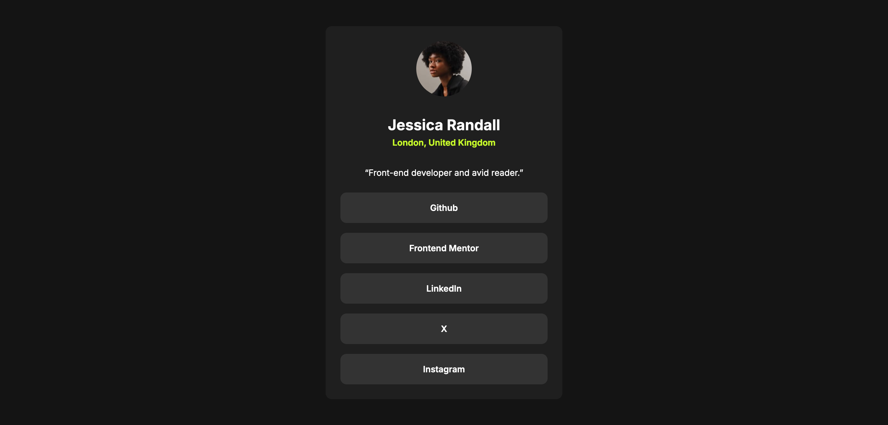

# Frontend Mentor - Social links profile solution

This is a solution to the [Social links profile challenge on Frontend Mentor](https://www.frontendmentor.io/challenges/social-links-profile-UG32l9m6dQ). Frontend Mentor challenges help you improve your coding skills by building realistic projects. 

## Table of contents

- [Overview](#overview)
  - [The challenge](#the-challenge)
  - [Screenshot](#screenshot)
  - [Links](#links)
- [My process](#my-process)
  - [Built with](#built-with)
  - [What I learned](#what-i-learned)
  - [Useful resources](#useful-resources)
- [Author](#author)

## Overview

### The challenge

Users should be able to:

- See hover and focus states for all interactive elements on the page

### Screenshot

### Links

- Solution URL: [solution URL here](https://github.com/priyavrat8065/social-link-profile-card)
- Live Site URL: [live site URL here](https://priyavrat8065.github.io/social-link-profile-card/)

## My process

### Built with

- Semantic HTML5 markup
- CSS custom properties
- Flexbox
- Mobile-first workflow

### What I learned

In this project i learnt how to use min() and calc() functions to create responsive width. I also learnt how to center the card in the center (both vertically and horizontally) using flex properties.

### Useful resources

- [mdn link for any-link pseudo class](https://developer.mozilla.org/en-US/docs/Web/CSS/:any-link) - This helped me how to use any-link pseudo class. I really liked this pattern and will use it going forward.
- [Use google web fonts helper](https://gwfh.mranftl.com/fonts) to download the fonts so that i could use it from within the project.

## Author 
- Frontend Mentor - [@priyavrat8065](https://www.frontendmentor.io/profile/priyavrat8065)
- My github dashboard. You can follow me there - [Github](https://github.com/dashboard)

